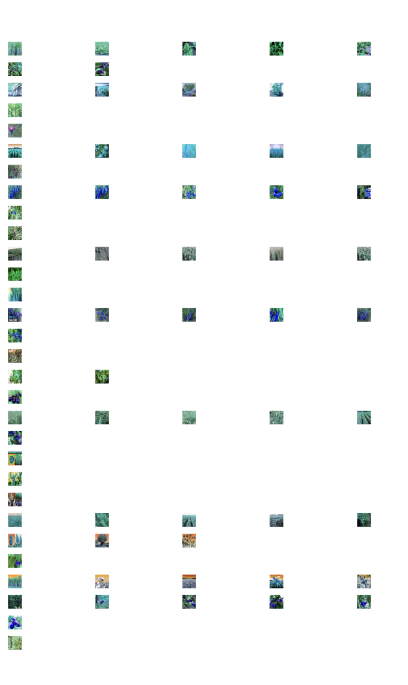

# Flight Stablity
- Elevation
- Angle of Rotation
- Flight time based on weight (for consistency across different runs and to test maximum extent to which drone can fly)

# Experiment
Flying the drone across different areas growing only one type of crop, we are able to get a good estimate of the accuracy of the unsupervised model by checking it against a pre-built model.

Also, for each field, try different cameras. Widelens camera vs low quality camera. How much does image quality play into accuracy?

## Assumptions
- Drone image quality (e.g. lighting, camera shake, etc.) consistent across all images and all fields.
- Our dataset we use to train is a good representation of crops in actual fields in California

## Possible Metrics
- Percent correctly grouped against pre-built model per field
- Silhouette Score: similar samples are to their own cluster compared to other clusters. Ranges from -1 to 1, with higher scores indicating better-defined clusters
- Davies-Bouldin Index: average similarity ratio of clusters. Lower scores are better.

